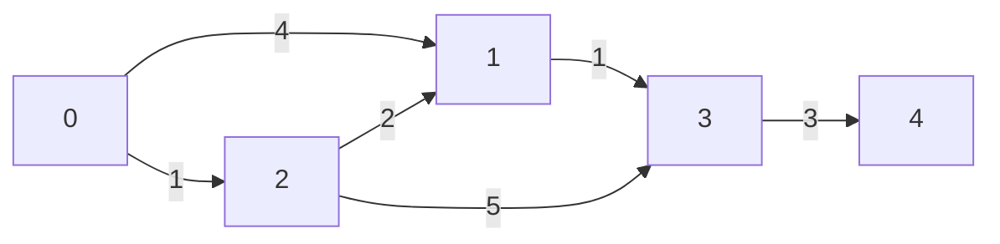

### Algoritmo Dijkstra
#### Conceito:
- Resolver o problema de caminhos mínimos de fonte única em um grafo dirigido 
ponderado $G = (V, E)$ onde os pesos das arestas são não negativos.

- Na implementação faz-se o uso de uma fila de prioridade mínima para gerenciar 
os vértices e suas respectivas distâncias acumuladas, dando mais eficiência ao algoritmo.

- Ao final teremos as distancias mínimas da origem para todos os vértices alcançáveis .

#### Abordagens:
##### Fila de Prioridade Mínima:
Seu tempo de execução das seguintes operações estão em torno de $O(logn)$ e $O(1)$
- _Insert_(S, x): insere o elemento x no conjunto S, $S = S \cup {x}$.
- _Remove_(S): Remove e retornar o elemento com menor prioridade.
- _Peek_(S): Verifica o elemento com a menor prioridade sem remover.
- _Update_(S, x, k): modifica o valor da chave x para o valor k e ajusta sua nova
posição na heap

#### Referências:
[Cormen - capítulo 22, página 620
](https://drive.google.com/file/d/1pZy5bV4Ms8VUuD7hBaijT0yKDL0bkWDE/view?usp=drive_link)

